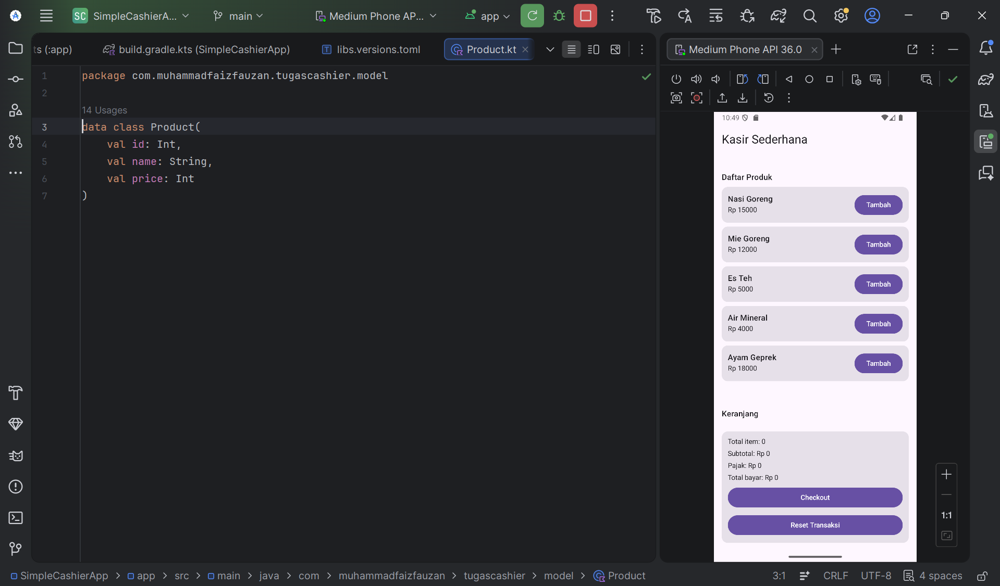
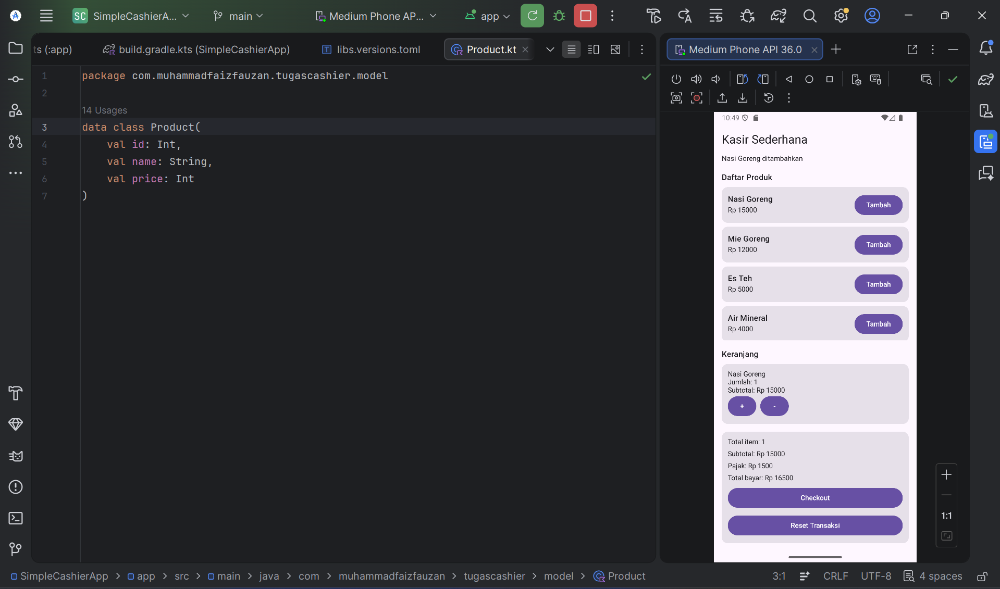
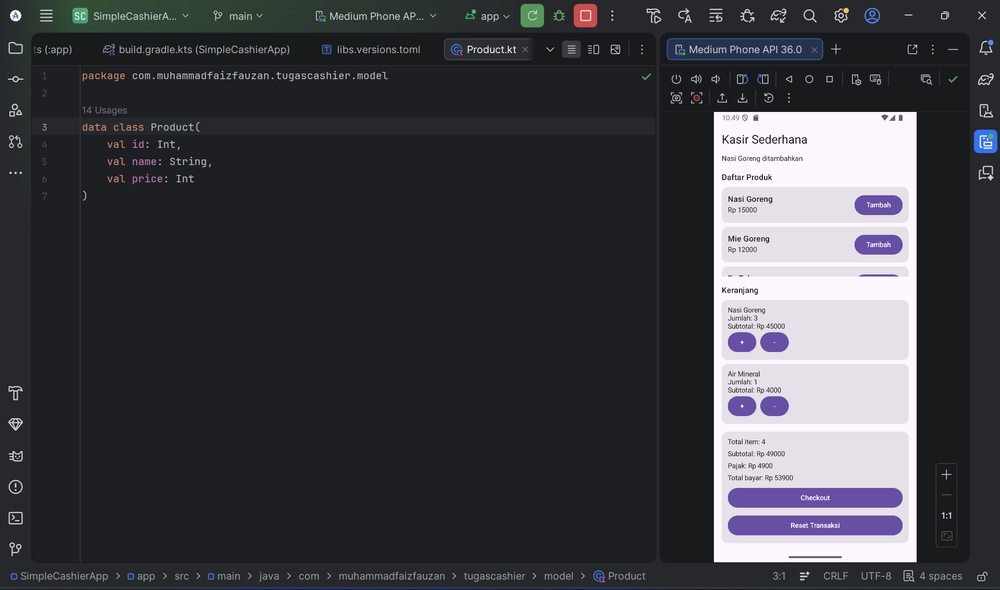
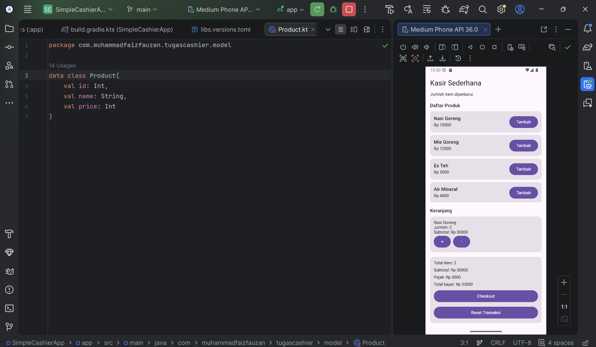
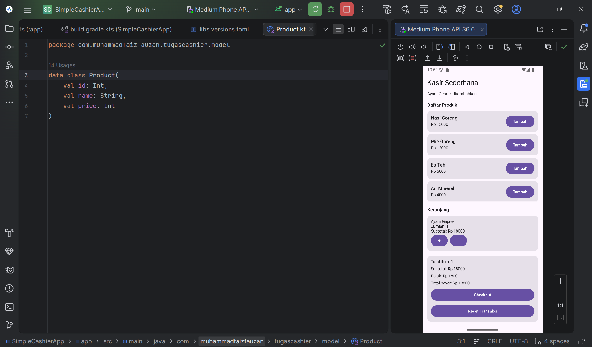
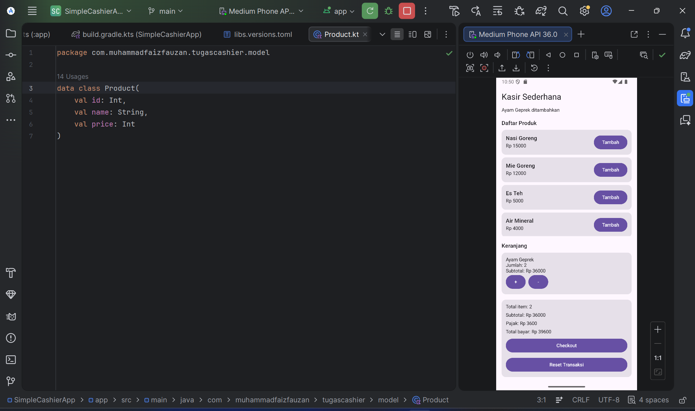
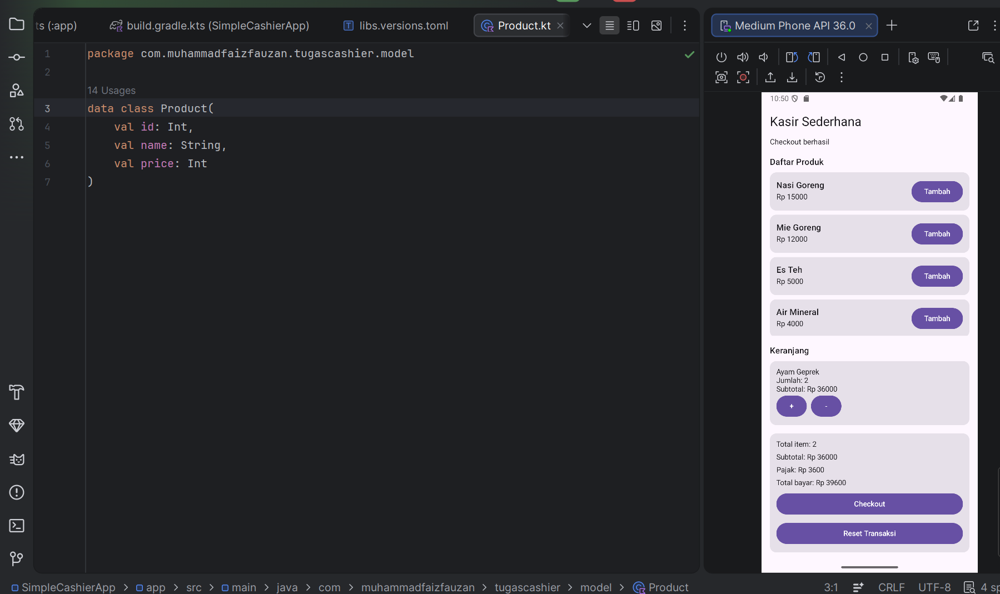
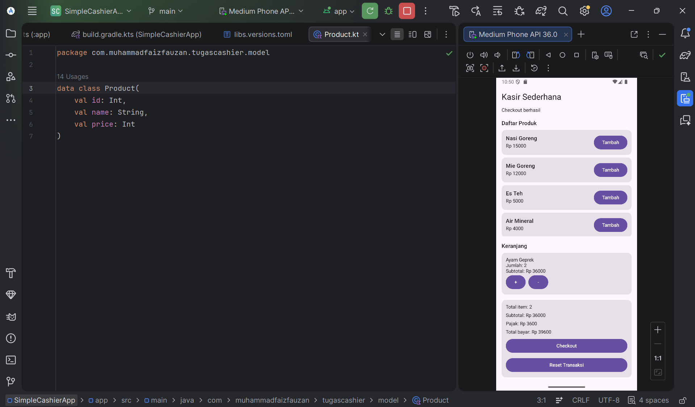
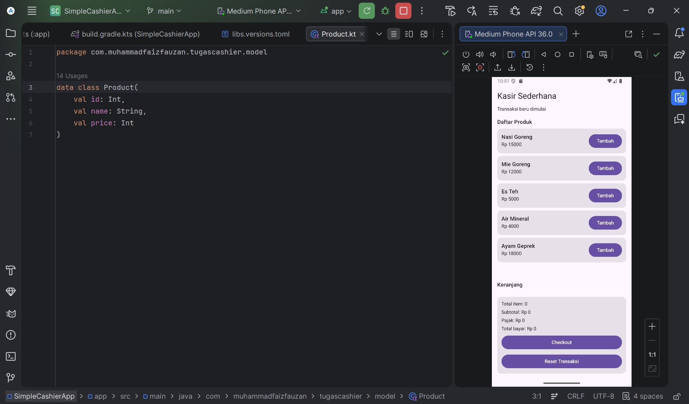

# SimpleCashierApp - Aplikasi Kasir Sederhana

Aplikasi Kasir Sederhana ini merupakan tugas handsout untuk mata kuliah **Pemrograman Sistem Interaktif**. Aplikasi ini dirancang menggunakan **Android Studio** dengan teknologi modern **Jetpack Compose** untuk membangun antarmuka deklaratif yang responsif, serta menerapkan arsitektur **MVVM (Model-View-ViewModel)** untuk pemisahan logika bisnis yang bersih.

---

## 👤 Identitas Pengembang

- **Nama:** Muhammad Faiz Fauzan
- **NIM:** 235150201111061
- **Program Studi:** Teknik Informatika

---

## 🛠️ Tech Stack & Spesifikasi Proyek

- **Bahasa Pemrograman:** Kotlin (Kotlin 2.2.10)
- **UI Framework:** Jetpack Compose (Material 3)
- **Arsitektur:** Model-View-ViewModel (MVVM)
- **Minimum SDK:** API 24 (Android 7.0 - Nougat)
- **Target SDK:** API 36 (Android 14 / Upside Down Cake)
- **Build System:** Gradle (Kotlin DSL - `build.gradle.kts`)

---

## 📁 Struktur Kode Proyek

Struktur folder pada repositori ini dirancang secara modular guna mempermudah pemeliharaan dan skalabilitas aplikasi:

```text
app/src/main/java/com/muhammadfaizfauzan/tugascashier/
│
├── data/
│   └── DummyProductData.kt      # Menyediakan data produk tiruan (mock) untuk aplikasi
│
├── model/
│   ├── Product.kt               # Data class representasi produk (id, nama, harga)
│   ├── CartItem.kt              # Data class representasi item dalam keranjang (produk, kuantitas, subtotal)
│   └── CashierUiState.kt        # Data class state UI (daftar produk, isi keranjang, total harga, pajak, pesan feedback)
│
├── viewmodel/
│   └── CashierViewModel.kt      # Mengelola logika bisnis (tambah/kurangi produk, checkout, reset transaksi)
│
├── ui/
│   ├── component/
│   │   ├── ProductCard.kt       # Komponen kartu informasi produk (daftar menu)
│   │   ├── CartItemRow.kt       # Komponen baris item produk di dalam keranjang belanja
│   │   └── SummarySection.kt    # Komponen kalkulasi total (total item, subtotal, pajak 10%, tombol aksi)
│   │
│   ├── screen/
│   │   └── CashierScreen.kt     # Halaman layar utama kasir (menyatukan komponen UI)
│   │
│   └── theme/
│       ├── Color.kt             # Definisi skema warna aplikasi (Material 3)
│       ├── Theme.kt             # Konfigurasi tema dasar aplikasi
│       └── Type.kt              # Konfigurasi tipografi teks aplikasi
│
└── MainActivity.kt              # Entry point aplikasi (menginstansiasi ViewModel dan memanggil CashierScreen)
```

## Alur Penggunaan & Tangkapan Layar (Screenshots)

_1. Tampilan Awal saat Aplikasi Dibuka_


> Saat pertama kali aplikasi dijalankan, daftar produk bawaan (Nasi Goreng, Mie Goreng, Es Teh, Air Mineral, Ayam Geprek) langsung dimuat dan ditampilkan pada layar utama. Keranjang belanja dalam keadaan kosong dan total biaya bernilai Rp 0.

_2. Menambahkan Produk ke Keranjang (Add to Cart)_


> Ketika menekan tombol "Tambah" pada salah satu kartu produk, item tersebut akan langsung dimasukkan ke dalam keranjang belanja. Sistem juga menampilkan pesan umpan balik (feedback) berupa teks di bagian atas layar untuk mengonfirmasi bahwa produk telah berhasil ditambahkan.

_3. Penambahan Jumlah Item di Keranjang_


> Pengguna dapat meningkatkan kuantitas produk yang sudah ada di dalam keranjang belanja menggunakan tombol kontrol yang disediakan. Jumlah item diperbarui secara dinamis dan akurat di dalam daftar keranjang.

_4. Mengurangi atau Menghapus Item dari Keranjang_



> Menekan tombol "-" akan mengurangi kuantitas produk bersangkutan sebanyak 1 item. Apabila kuantitas saat ini bernilai 1 kemudian tombol "-" ditekan kembali, sistem secara otomatis menghapus produk tersebut sepenuhnya dari daftar keranjang belanja.

_5. Perhitungan Subtotal, Pajak, dan Total Otomatis_



> Setiap kali terjadi perubahan kuantitas atau penambahan produk baru ke dalam keranjang, sistem akan menghitung ulang rincian pembayaran secara otomatis dan real-time

_6. Proses Checkout Berhasil_


> Jika keranjang belanja minimal berisi satu produk dan pengguna menekan tombol "Checkout", sistem akan memproses transaksi dan menampilkan pesan sukses berupa teks "Checkout berhasil" di bagian atas layar.

_7. Validasi Checkout Gagal (Keranjang Kosong)_


> Apabila pengguna menekan tombol "Checkout" dalam kondisi keranjang belanja masih kosong, sistem akan memblokir tindakan tersebut dan menampilkan pesan peringatan berbunyi "Keranjang masih kosong".

_8. Melakukan Reset Transaksi_



> Tombol "Reset Transaksi" digunakan untuk membersihkan seluruh isi keranjang belanja sekaligus mereset kalkulasi nominal pembayaran kembali ke Rp 0. Layar akan diperbarui secara instan dan menampilkan status pesan "Transaksi baru dimulai".
